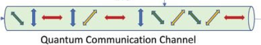

# Quantum-BB84

## Quantum Key Distribution

### Without external observer

In 1984, building on the work of *Wiesner*, *Charles Bennett*, an IBM's researcher, and *Gilles Brassard*, of the Université de Montréal, developed the first **quantum cryptographic protocol**, which goes under the codename of **BB84**. 

Suppose that *Alice* and *Bob* are connected via a **quantum channel** that they can use to exchange qubits. This channel is not used directly to send a private message, but only to exchange random qubits that after processing will compose the encryption key.

More specifically *Alice* produces an **initial key**, selecting a sequence of **random bits**, '$0$' and '$1$', and picking a sequence of **polarization eigenstates**, with respect to a randomly chosen basis between: **rectilinear** $\{\lvert 0 \rangle,\  \lvert 1 \rangle\}$ and **diagonal** $\{\lvert \nearrow \rangle,\  \lvert \searrow \rangle\}$.

*Alice* encodes the classical bits of the key one by one in a **qubit**, by preparing each qubit in an eigenstate of the basis chosen, so that only by measuring the qubits in the **right basis** one can retrieve with **certainty** the right classical bit, just as it happens with quantum money. In the meantime *Alice* keeps a note (in a **table**) of the basis that she has picked for every single qubit she has encoded.

Now, using the quantum channel, she sends the stream of qubits to *Bob*, who is **unaware** of the basis used by *Alice* for the encoding. *Bob* receives these qubits prepared in a certain polarization eigenstate but, due to the **no-cloning theorem**, he is unable to recognize which basis *Alice* used, because he cannot distinguish **non-orthogonal states** with a single measurement. Nonetheless he proceeds anyway with measuring each photon's polarization using a basis chosen randomly (between rectilinear and diagonal), and he keeps a note of the measurement result and the associated basis that he used in a report **table**. 

Statistically, *Bob* will pick the **right basis**, the same that *Alice* picked, about **$1/2$** of the times, and the wrong basis about **$1/2$** of the times. When he measures using the right basis he correctly retrieves the information bit of the key, but when he picks the wrong basis the information bit is not certain, since with respect to this basis, the qubit is in a **superposition** of the eigenstates of the right bases, and it can collapse in either two of them with equal probability of **$1/2.$**

For this reason *Alice* and *Bob* decide to **sift** their key, which in practical terms means that they discard from the key all the bits obtained via measurements made in the wrong basis, since they are not reliable. The price for this action is that the key will lose about **$1/2$** of its length, but the payoff is that they don't need to unveil their measurements, they just need to compare their tables, where they recorded the basis chosen, and they do that **after** the measurement has occurred.

So they open the **classical channel** and only now *Alice* tells (publicly) *Bob* which basis she used to encode the key; they **compare** the **tables** and discard the bits obtained measuring qubits in different basis. What they obtain is a perfectly correlate **sifted key**, the same for both of them, ready for use. This key can be employed as a one-time pad and once is used up completely, the procedure can be repeated again to produce a new random key. 

### With external observer name's Eve

What happens if we now introduce an **eavesdropper** in the communication? Suppose that *Eve* is able to intercept the qubits that Alice sends to Bob, and that she can also tap the classical communication channel. When she gets hold of the qubits she still doesn't know which basis *Alice* used, just like *Bob*. She is forced to make a guess, and she will pick the wrong basis **$1/2$** of the times. If she measures in the wrong basis she has **$1/2$** probability to make the qubit collapse in the wrong eigenstate, so that on the whole she will have altered about **$1/4$** of the original qubits. This is the main difference with classical crypto: thanks to quantum mechanics observing implies measuring, and if this is not done accordingly, it changes the actual state (key).

*Eve* produces a **candidate key** and passes on these (now altered) qubits to Bob who proceeds himself with his measurements. *Bob* constructs his table list of random basis and also obtains his candidate key, which will of course be different from *Eve*'s. When* Alice* broadcasts his basis table on the classical channel and *Bob* sift his  key accordingly, he will obtain a key different from *Alice*'s, unusable, since even in the same basis choice qubits will be different about **$1/4$** of the times. If *Alice* try to encrypt a message, symmetrical cryptography would fail and both *Alice* and *Bob* will know that communication has been compromised. 

If *Alice* and *Bob* never compare their measurement and they only compare basis tables they have no way of knowing that the state has been altered, until the encrypted message is produced, sent and decryption fails. However they can decide to initiate **key sharing** by also comparing their measurement on a certain number of qubits, and, only when they are convinced that the channel is free of interference, they proceed with the actual key sharing. Of course the part of the key that represents the unveiled measurement has to be discarded from it. In real world application is comprises about $1/3$ of the whole key.

